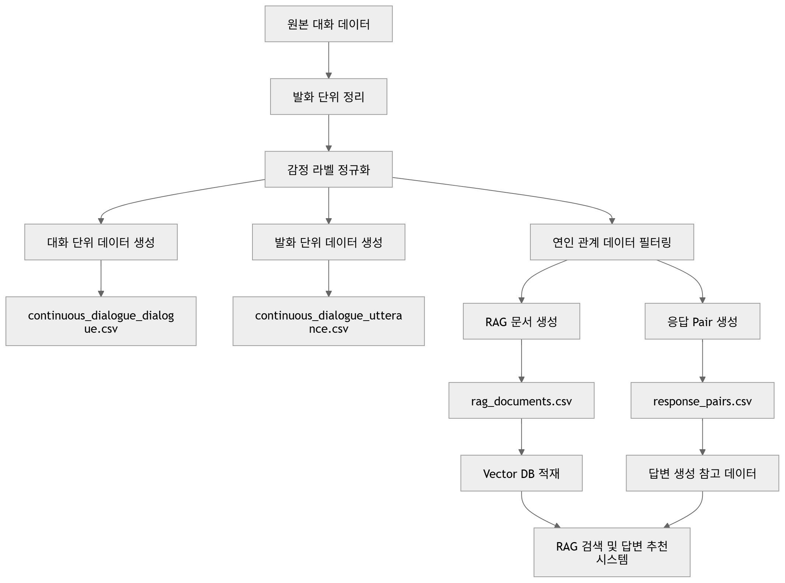

# 데이터 설명 문서

## 1. 문서 목적

본 문서는 프로젝트에서 사용하는 주요 전처리 데이터 4종의 역할, 구조, 생성 방식, 활용 목적을 정리한 문서이다.

본 프로젝트는 연인 관계 갈등 상황에 대한 감정 분석, 위험도 분석, RAG 기반 답변 추천을 목표로 하며, 데이터는 크게 분석용 데이터와 검색/추천용 데이터로 구분된다.

---

## 2. 전체 데이터 구성

### 2-1. 데이터 설계 의도

본 프로젝트의 데이터는 단순 저장 목적이 아니라  
"감정 분석 + 위험도 분석 + RAG 기반 답변 생성"을 동시에 지원하기 위해 설계되었다.

- 감정 분석 데이터 → 모델 입력 및 감정 분류 기준 제공
- RAG 문서 데이터 → 유사 사례 검색 및 상황 이해 강화
- 응답 pair 데이터 → 실제 답변 생성 시 문체 및 대응 방식 참고

👉 각 데이터셋은 서로 다른 역할을 수행하지만,  
전체 파이프라인에서 유기적으로 연결되도록 설계하였다.

### 2-2. 감정 분석 및 위험도 분석용 데이터

- `continuous_dialogue_dialogue.csv`
- `continuous_dialogue_utterance.csv`

### 2-3. RAG 검색 및 답변 추천용 데이터

- `rag_documents.csv`
- `response_pairs.csv`

---

## 3. 파일별 상세 설명

### 3-1. continuous_dialogue_dialogue.csv

#### 목적
대화 전체 단위의 감정 흐름과 대화 길이를 파악하기 위한 데이터이다.

#### 생성 방식
원본 발화 데이터를 전처리한 뒤, 동일한 대화 그룹을 기준으로 발화를 통합하여 생성하였다.

#### 주요 활용
- 대화 전체 분위기 분석
- 감정 흐름 시퀀스 확인
- 갈등 위험도 판단 보조

#### 주요 컬럼
- `dialogue_group_id`: 대화 그룹 고유 ID
- `full_dialogue`: 대화 전체 텍스트
- `emotion_sequence`: 대화 내 감정 흐름
- `turn_count`: 총 발화 수

### 3-2. continuous_dialogue_utterance.csv

#### 목적
개별 발화 단위의 감정 분석을 수행하기 위한 데이터이다.

#### 생성 방식
원본 데이터를 정리한 뒤, 감정 문자열 정규화, 오타 수정, 유효 감정 필터링 과정을 거쳐 생성하였다.

#### 주요 활용
- 발화 단위 감정 분류
- 위험 표현 탐색
- 감정 분석 모델 입력 데이터

#### 주요 컬럼
- `dialogue_group_id`: 대화 그룹 고유 ID
- `turn_index`: 발화 순서
- `utterance`: 발화 텍스트
- `emotion`: 감정 라벨

### 3-3. rag_documents.csv

#### 목적
유사 갈등 사례 검색을 위한 RAG 핵심 문서 데이터이다.

#### 생성 방식
공감형 대화 데이터에서 연인 관계 대화를 중심으로 추출하고, 대화 1개를 1개 문서 단위로 정리하였다.

#### 주요 활용
- 사용자 입력과 유사한 갈등 사례 검색
- RAG 기반 답변 생성의 근거 문서 제공
- 감정 및 위험도 기반 검색 보조

#### 주요 컬럼
- `dialogue_id`: 대화 고유 ID
- `file_name`: 원본 파일 식별 정보
- `relation`: 관계 유형
- `situation`: 상황 요약
- `speaker_emotion`: 화자 감정
- `listener_behavior`: 청자 반응 요약
- `avg_rating`: 평균 평점
- `grade`: 응답 등급
- `speaker_texts`: 화자 발화 모음
- `listener_texts`: 청자 발화 모음
- `full_dialogue`: 전체 대화
- `listener_empathy_tags`: 공감 태그
- `final_speaker_change_emotion`: 최종 감정 변화
- `risk_level`: 갈등 위험도
- `turn_count`: 발화 수
- `terminated`: 대화 종료 여부

#### 전처리 참고
- `final_speaker_change_emotion`의 결측값은 `unknown`으로 통일하였다.
- 연인 관계 갈등 상황 검색에 활용될 수 있도록 관계, 상황, 감정, 위험도 정보를 포함하였다.

### 3-4. response_pairs.csv

#### 목적
문맥과 실제 응답 쌍을 구성하여 추천 답변 생성에 활용하기 위한 데이터이다.

#### 생성 방식
공감형 대화에서 청자 응답이 등장하는 지점을 기준으로, 응답 직전 문맥과 실제 청자 응답을 1개 pair로 구성하였다.

#### 주요 활용
- 실제 응답 예시 제공
- 문맥 기반 답변 추천
- 공감형, 조언형, 갈등 완충형 답변 생성 참고

#### 주요 컬럼
- `dialogue_id`: 대화 고유 ID
- `relation`: 관계 유형
- `situation`: 상황 요약
- `speaker_emotion`: 화자 감정
- `context_before_response`: 응답 직전 문맥
- `listener_response`: 실제 청자 응답
- `listener_empathy`: 응답 공감 유형
- `terminate`: 응답 후 종료 여부

#### 전처리 참고
- `listener_empathy`의 결측값은 `미분류`로 통일하였다.
- 응답 예시는 RAG 기반 답변 생성 시 참고 문체 및 대응 방식으로 활용된다.

---

## 4. 데이터 생성 및 활용 흐름

본 프로젝트의 데이터는 전처리 과정을 거쳐 감정 분석 및 RAG 기반 답변 생성에 활용되며, 전체 흐름은 아래와 같다.

👉 위 흐름을 통해 생성된 데이터는 Vector DB에 저장되거나, 감정 분석 및 답변 생성 모델의 입력 데이터로 활용된다.

---

## 5. 모델 적용 방식

각 데이터셋은 다음과 같은 방식으로 실제 모델에 활용된다.

- continuous_dialogue_utterance.csv  
  → Gemini 감정 분석 모델 입력 데이터로 활용

- continuous_dialogue_dialogue.csv  
  → 전체 상황 요약 및 감정 흐름 보조 분석

- rag_documents.csv  
  → 사용자 입력과 유사한 갈등 사례 검색 (Vector DB)

- response_pairs.csv  
  → GPT 답변 생성 시 참고 문장 및 스타일 가이드로 활용

👉 이를 통해 단순 생성이 아닌  
"분석 + 검색 + 생성"이 결합된 구조를 구현하였다.

---

## 6. 데이터 품질 관리

데이터 품질을 유지하기 위해 다음과 같은 전처리 기준을 적용하였다.

- 감정 라벨 정규화 (동일 표현 통일)
- 결측값 처리 (unknown, 미분류 등으로 통일)
- 비연인 관계 데이터 필터링
- 불필요한 특수문자 및 노이즈 제거
- 응답 데이터에서 상담형 문장 비중 점검

👉 이를 통해 감정 분석 정확도와 RAG 검색 품질을 동시에 확보하였다.