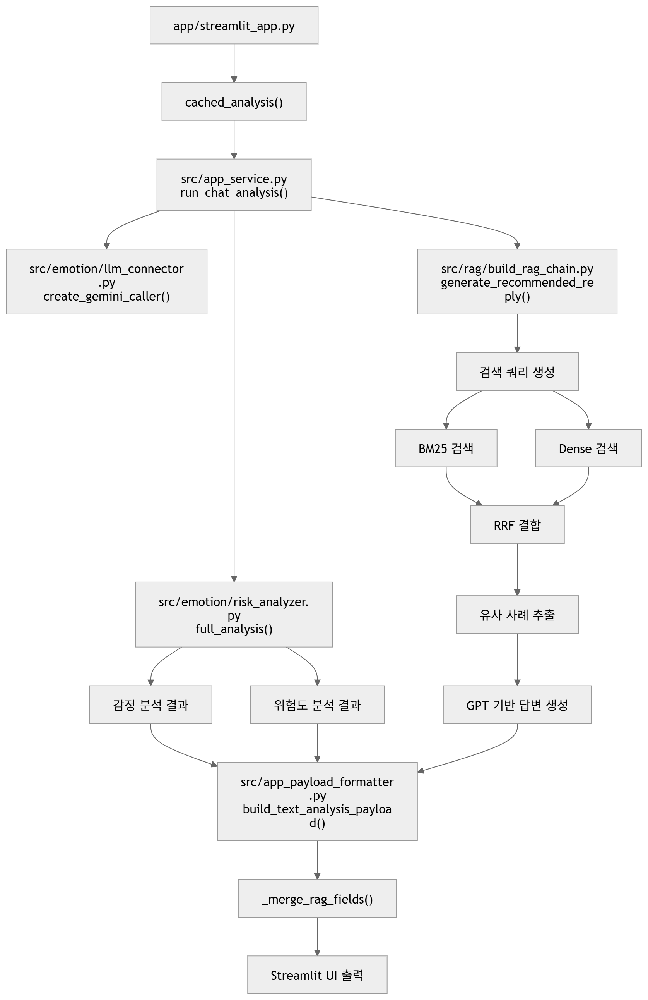

# 개발된 소프트웨어 설명서

## 1. 개요
본 소프트웨어는 연인 갈등 상황을 분석하고  
적절한 답장 메시지를 추천하는 AI 시스템이다.

LLM(Gemini, GPT)과 RAG 구조를 결합하여  
정확한 분석과 실용적인 응답 생성을 목표로 한다.

---

## 2. 주요 기능

### 2-1 감정 분석
- 발화 단위 감정 분류
- 7가지 감정 라벨 사용
  - 중립, 놀람, 분노, 슬픔, 행복, 혐오, 공포

### 2-2. 갈등 위험도 분석
- 5단계 위험도 분류
  - 안전 / 주의 / 경고 / 위험 / 심각
- 감정 강도, 표현 수위, 관계 위협 등을 종합 분석

### 2-3. RAG 기반 답변 생성
- 유사 사례 검색
- 검색 결과 기반 답변 생성

### 2-4. 답변 스타일 생성
- 공감형
- 조언형
- 갈등 완충형

### 2-5. 표현 개선 기능
- 피해야 할 표현 제시
- 대체 표현 추천

---

## 3. 기술 스택

- Python
- Streamlit
- Gemini API
- OpenAI API
- Pinecone
- LangChain

---

## 4. 핵심 구현 내용

### 4-1. Gemini 기반 분석
- JSON 구조화 출력
- 감정 + 위험도 통합 분석

### 4-2. RAG 검색 구조

- BM25 (키워드 기반)
- Dense (임베딩 기반)
- RRF 결합

### 4-3. 답변 생성 로직

- Prompt 기반 스타일 분리 생성
- 응답 예시 기반 가이드 제공

### 4-4. 출력 파싱 및 보정

- 태그 기반 구조화
- repair prompt 적용
- 누락 데이터 자동 보완

---

## 5. 코드 구조

<pre>
src/
├── emotion/
│   ├── emotion_analyzer.py      # 감정 분석
│   ├── risk_analyzer.py         # 위험도 분석
│   └── llm_connector.py         # Gemini 연결 및 라우팅
│
├── rag/
│   └── build_rag_chain.py       # RAG 검색 및 답변 생성
│
├── app_service.py               # 전체 파이프라인 연결
└── streamlit_app.py            # UI 및 사용자 인터페이스
</pre>

---

## 6. 차별점

본 시스템은 기존 챗봇과 달리 다음과 같은 특징을 가진다.

- 단순 상담형 응답이 아닌 "실제 메시지 형태 답장 생성"
- 감정 + 위험도를 동시에 고려한 대응 전략 생성
- RAG 기반 실제 연인 갈등 사례 활용 (환각 감소)
- LLM 출력 구조 파싱 및 후처리 기반 안정화
- 사용자 입력 기반 상황 유지 (임의 상황 생성 방지)

👉 단순 정보 제공이 아닌 “실제로 사용할 수 있는 행동 중심 응답”을 생성하는 데 초점을 둔다.

---

## 7. 한계 및 개선 방향

- 데이터 다양성 부족
- 감정 분석 정확도 개선 필요
- 실시간 대화 대응 기능 추가 가능

---

## 8. 전체 처리 흐름

본 소프트웨어는 사용자 입력을 받은 뒤 감정 분석, 위험도 분석, RAG 검색, 답변 생성을 순차적으로 수행한다.

본 시스템의 전체 처리 흐름은 아래와 같으며, 각 단계는 독립적인 모듈로 구성되어 순차적으로 수행된다.



👉 위 흐름은 app_service.py를 중심으로 각 모듈(emotion, rag, parsing)이 연결되어 수행된다.

---

## 9. 주요 함수 호출 흐름

<pre>
streamlit_app.py
└── cached_analysis()
    └── run_chat_analysis()
        ├── create_gemini_caller()
        ├── full_analysis()
        │   ├── 감정 분석
        │   └── 위험도 분석
        ├── generate_recommended_reply()
        │   ├── BM25 검색
        │   ├── Dense 검색
        │   ├── RRF 결합
        │   └── GPT 답변 생성
        ├── build_text_analysis_payload()
        └── _merge_rag_fields()
</pre>

---

## 10. 핵심 설계 선택 이유

### 10-1. Gemini 사용

- 한국어 감정 및 문맥 이해 성능이 우수함
- 감정 분석과 위험도 분석을 JSON 형태로 구조화하기 적합함
- 벤치마크 결과에서 언어추론, 논리추론, 감정분석 모두 높은 성능을 보임

### 10-2. RAG 구조 사용

- 단순 LLM 생성만 사용할 경우 발생할 수 있는 환각 문제를 줄이기 위함
- 실제 유사 사례를 기반으로 답변을 생성할 수 있음
- 사용자 상황과 유사한 대화 사례를 참고하여 더 현실적인 답변을 제공할 수 있음

### 10-3. BM25 + Dense + RRF 검색 구조

- BM25는 키워드 기반 검색에 강점이 있음
- Dense 검색은 의미 기반 유사도 검색에 강점이 있음
- RRF는 두 검색 결과를 결합하여 검색 안정성과 정확도를 높이기 위해 사용함

### 10-4. Streamlit 사용

- 빠르게 UI를 구현하고 테스트하기 적합함
- 채팅형 입력, 분석 결과 카드, 추천 답변 영역을 직관적으로 구성할 수 있음
- 세션 상태 관리를 통해 최근 대화 및 분석 결과를 유지할 수 있음

---

## 11. 출력 안정화 설계

LLM 응답은 항상 동일한 형식으로 반환되지 않을 수 있으므로, 출력 안정화를 위한 후처리 로직을 적용하였다.

- 태그 기반 섹션 파싱
- 공감형 / 조언형 / 갈등 완충형 답변 분리
- 피해야 할 표현 / 대체 표현 리스트 정리
- 빈 문자열 및 중복 항목 제거
- 누락 필드 발생 시 RAG 결과와 Gemini 보조 결과 병합

이를 통해 UI에서 빈 카드가 생성되거나, 필요한 항목이 누락되는 문제를 줄였다.

### 11-1. 출력 파싱 상세 로직

LLM 응답은 항상 동일한 형식으로 생성되지 않기 때문에  
태그 기반 파싱 및 후처리 로직을 통해 출력 구조를 안정화하였다.

#### 주요 처리 과정

- [상황 요약], [감정], [위험도] 태그 기준 분리
- 공감형 / 조언형 / 갈등 완충형 답변 추출
- 피해야 할 표현 / 대체 표현 리스트화

#### 후처리 로직

- 불필요한 문구 제거 ("없음", "예:" 등)
- 문장 분리 (쉼표 / 줄바꿈 기준)
- 최대 출력 개수 제한 (UI 기준)
- 유효 표현 필터링 (`is_valid_phrase`)

👉 이를 통해 LLM 출력의 불안정성을 보완하고 UI 일관성을 유지한다.

## 11-2. 실제 서비스 관점 구현

본 소프트웨어는 단순 기능 조합이 아니라  
"입력 → 분석 → 검색 → 생성 → 파싱 → UI 출력"까지  
전체 파이프라인이 하나의 흐름으로 연결된 구조로 구현되었다.

각 단계는 모듈화되어 있으며,  
서비스 레이어(app_service.py)를 중심으로 전체 로직이 통합 관리된다.

👉 이를 통해 유지보수성과 확장성을 동시에 확보하였다.

---

## 12. 최종 정리

본 소프트웨어는 단순 챗봇이 아니라, 감정 분석·위험도 분석·RAG 검색·답변 생성을 하나의 흐름으로 연결한 AI 서비스이다.

특히 사용자의 갈등 상황을 분석한 뒤 실제 메시지로 활용 가능한 답변을 제공하도록 설계되었으며, LLM 출력 안정화를 위한 파싱 및 보정 로직까지 포함한다.

---

## 13. 시스템 동작 요약

본 시스템은 다음과 같은 파이프라인으로 동작한다.

```
사용자 입력
→ 감정/위험도 분석 (Gemini)
→ 유사 사례 검색 (RAG)
→ 답변 생성 (GPT)
→ 출력 보정 및 UI 표시
```

이 구조를 통해 단순 응답 생성이 아닌  
**상황 이해 기반 실질적 대응 메시지 생성 시스템**을 구현하였다.